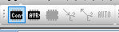
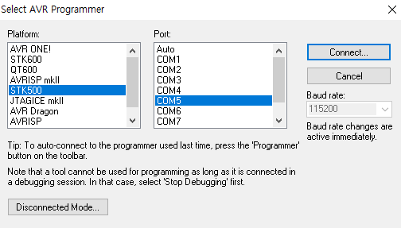

#AVR HW 스터디

- 일시 : 2019.01.11 20:00 ~ 22:00
- 작성자 : 유재덕

####학습 목표
- AVR보드 LED 점등 코드 해석 및 실습
- AVR을 활용하여 설계할 물품 토의

######추천 자료

마이크로 컨트롤러 AVR ATmega128/이상설 지음/2013년 발행

개발 환경 설정
1. 해당 영상을 따라 설치.
   [개발 환경 설정](https://www.youtube.com/watch?v=4LK3vprsKRM)
조영범 교수님께서 제공해주신 AVR Studio 4 사용. 상위버전은 설정도 복잡하고 오류날 가능성도 높기 때문에 사용을 지양할 것.
2. msys-1.0-vista64라는 파일 압축 해제 및 C:\WinAVR-20100110\utils\bin 에 붙여넣기.


######예제 코드
```c
#include <avr/io.h>
#include <util/delay.h>
#define F_CPU 1000000UL

int main(void){
   unsigned int i;
   DDRF= 0xF0;      //DDRX : X reg set up
    PORTF= 0x10;    //set X reg(8bit)
   
   while(1){
      for(i=0; i<4;i++){
         _delay_ms(1000);
         PORTF=PORTF<<1;    //shift
      }
      PORTF=0x10;
   }
   DDRB=0x80;
   DDRF=0xF0;)
   DDRG=0x00;
   PORTF=0x10;
}
```
코드 설명
Port F - 회로에서 LED를 키고 끄는것을 제어하는 역할
DDRF[0:7] - F Port useage or not
PORTF[0:7] - value of F Port
LED 점등의 경우 상위 4bit, 즉 DDRF[0:3]과 PORTF[0:3]만 사용

ex)
```c
DDRF=0xF0;
```
[0,0,0,0,0,0,0,0] ㅡ>[1,1,1,1,0,0,0,0]
상위 4 bit를 사용한다고 메인 보드에 예고

```c
PORTF=0x10;
```
[0,0,0,0,0,0,0,0] ㅡ>[0,0,0,1,0,0,0,0]
해당 비트의 값을 1로만듦. 1=점등

######프로그램 업로드

Click Display 'Connect' Dialog


Check connected port at Device Manager, set Platform(STK5000) and Port. Then, press Connect.

ㅡ> 보드 안가져와서 사진 추가 불가능. 이후 추가 바람

######제작 아이디어 토의
1. 타이머
2. [적외선 레이더](https://kocoafab.cc/make/view/444)
 서브모터와 적외선 거리 센서를 활용해 적외선 레이더 제작
3. [솔라 트레커](https://kocoafab.cc/make/view/341)
  서브모터와 조도센서를 활용해 솔라 트레커를 제작
  솔라 트레커 : 빛(광원)의 움직임에 따라 이동하는 장치
4. [적외선 리모콘](https://kocoafab.cc/tutorial/view/703)
   IRremote 모듈을 활용하여 적외선 리모콘 제작

5. 버스 정류장 open api 활용
   버스 정류장 open api를 활용하여 보다 개선된 방법으로 사용자에게 버스 운행 정보를 제공할 수 있는 장치 제작


