# AVR HW 스터디
- 개요
  - 3학년 실험을 대비한 AVR 학습 및 실습

## 예산
   - AVR 보드
   - AVR Studio 4
   - 케이블선
## 참여 인원
   - Boot4AVR
     - 김지형, 양형균, 이준형, 이재영, 권희정, 이석호, 최희정

## 개발 환경 설정
   -Software 
      -AVR Studio 4

     1. 해당 [영상](https://www.youtube.com/watch?v=4LK3vprsKRM)을 따라 설치.
         조영범 교수님께서 제공해주신 AVR Studio 4 사용. 상위버전은 설정도 복잡하고 오류날 가능성도 높기 때문에 사용을 지양할 것.
     2. msys-1.0-vista64라는 파일 압축 해제 및 C:\WinAVR-20100110\utils\bin 에 붙여넣기.
   - Hardware
      - AVR Board

추천 자료
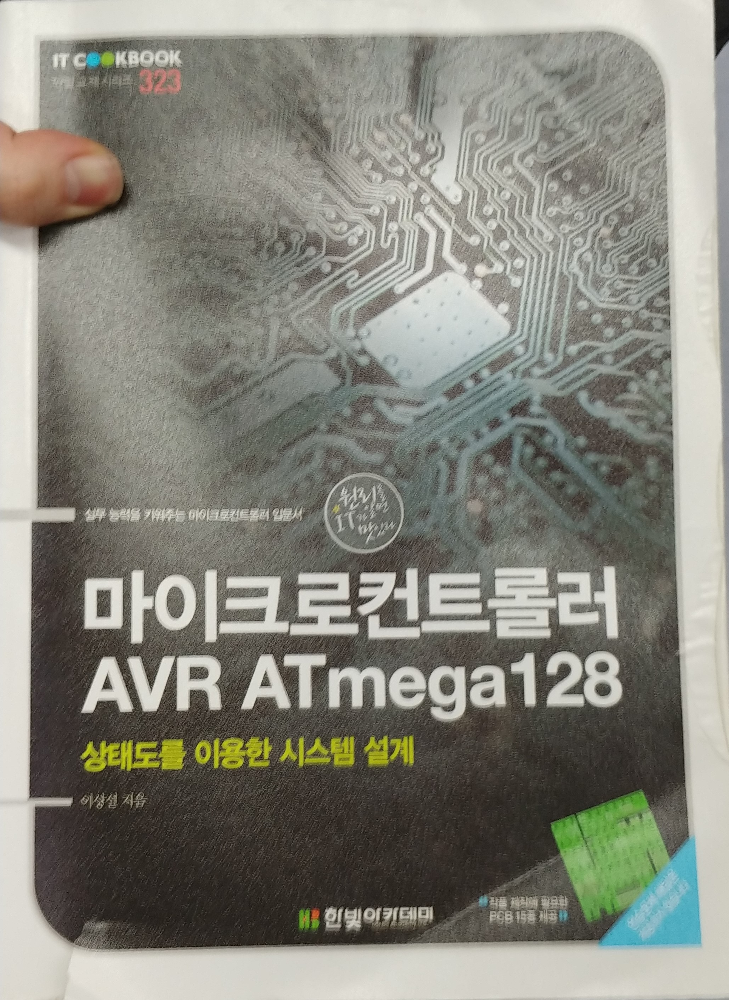
마이크로 컨트롤러 AVR ATmega128/이상설 지음/2013년 발행

## 개발 과정
Day 01 
  1. AVR보드 LED 점등 코드 해석 및 실습
  2. AVR을 활용하여 설계할 물품 토의    

Day 02
   1. ATmega128의 기본 구조 학습
   2. 7segment를 활용한 실습

Day 03
   1. Switch를 활용한 실습
   2. Interupt를 활용한 타이머 제작

### Day01
- 일시 : 2019.01.11 20:00 ~ 22:00
- 작성자 : 유재덕

학습 목표
  1. AVR보드 LED 점등 코드 해석 및 실습
  2. AVR을 활용하여 설계할 물품 토의


#### 1. AVR보드 LED점등 코드 해석 및 실습
######example01
```c
#include <avr/io.h>
#include <util/delay.h>
#define F_CPU 1000000UL

int main(void){
   unsigned int i;
   DDRF= 0xF0;      //DDRX : X reg set up
    PORTF= 0x10;    //set X reg(8bit)
   
   while(1){
      for(i=0; i<4;i++){
         _delay_ms(1000);
         PORTF=PORTF<<1;    //shift
      }
      PORTF=0x10;
   }
   DDRB=0x80;
   DDRF=0xF0;
   DDRG=0x00;
   PORTF=0x10;
}
```
코드 설명
Port F - 회로에서 LED를 키고 끄는것을 제어하는 역할
DDRF[0:7] - F Port init.
   - 만약 DDRF[4] = 1 일때, DDRF[4]는 output이라는 의미
   - 만약 DDRF[4] = 0 일때, DDRF[4]는 input이라는 의미

PORTF[0:7] - value of F Port
LED 점등의 경우 상위 4bit, 즉 DDRF[0:3]과 PORTF[0:3]만 사용

ex)
```c
DDRF=0xF0;
```
[0,0,0,0,0,0,0,0] ㅡ>[1,1,1,1,0,0,0,0]
상위 4 bit를 사용한다고 메인 보드에 예고

```c
PORTF=0x10;
```
[0,0,0,0,0,0,0,0] ㅡ>[0,0,0,1,0,0,0,0]
해당 비트의 값을 1로만듦. 1=점등

###### 프로그램 업로드
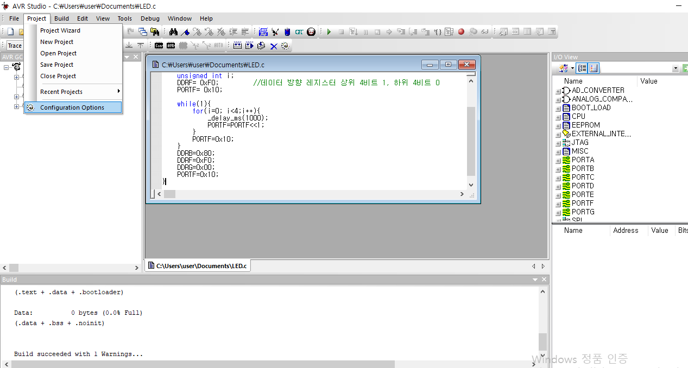
- Click Configuration Options

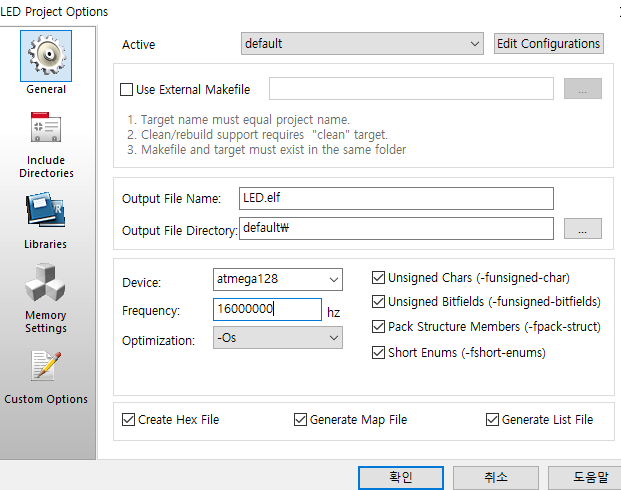
- Set frequency 16,000,000(보드마다 다름)

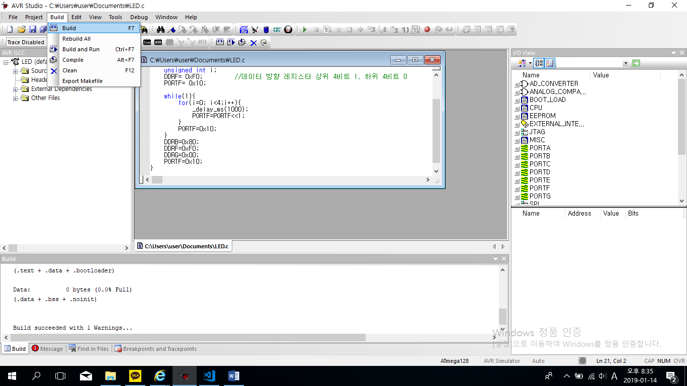
-Build program

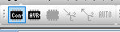
- Click Display 'Connect' Dialog

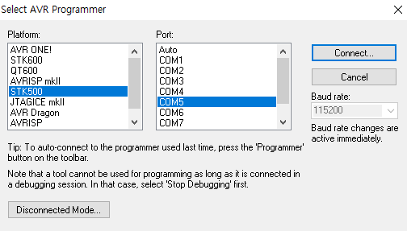
- Check connected port at Device Manager, set Platform(STK5000) and Port. Then, press Connect.

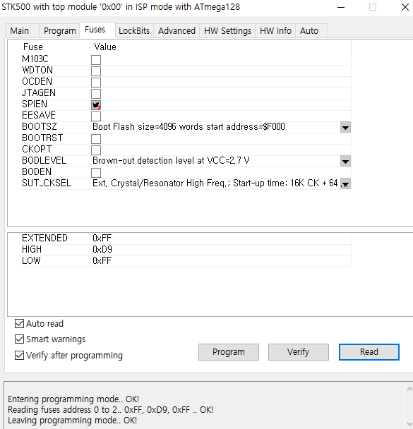
- Check fuse bit of board. 

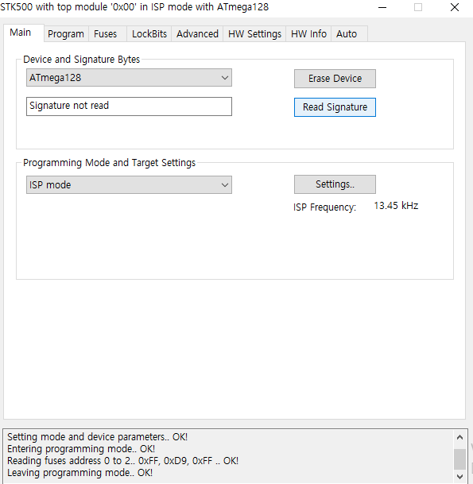
- Read Signature of board.

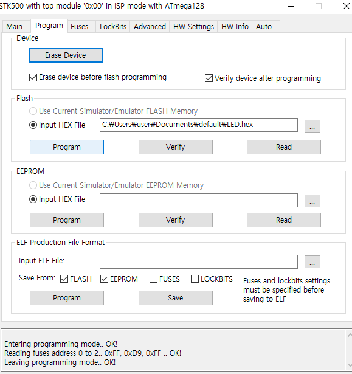
Set Input HEX File as coded file, press Program

##### 토의 사항
- [예제 코드](#example01)의 마지막 네 줄의 용도는 무엇인가?

##### Trouble Shoot
- 코드에서 설정한 delay에 비해 빠르게 점등되는 보드가 몇몇 있다. 어쨰서 이런 현상이 일어나는가?
  - AVR Studio의 기준 주파수가 있고, 보드 내의 기준 주파수가 있다. 이 둘이 서로 일치하지 않는 상황에서 코드를 업로드할 경우, 보드와 코트 사이에 충돌이 생길 수 있다. 

- 몇몇 보드는 AVR Studio에서 액세스 자체를 할 수 없다. 해당 현상의 원인은 무엇인가?
  - fuse bit을 임의로 바꾼 몇몇 보드들이 임의로 바꾼 환경과 보드의 환경이 서로 어긋나면서 보드 자체가 액세스를 거부하는 것으로 추정된다.
- while 문 이후에 있는 코드의 의미는?
  - 사실상 의미 없음. 이번 학기에 수정 예정.


#### 제작 아이디어 토의
1. 타이머
2. [적외선 레이더](https://kocoafab.cc/make/view/444)
 서브모터와 적외선 거리 센서를 활용해 적외선 레이더 제작
3. [솔라 트레커](https://kocoafab.cc/make/view/341)
  서브모터와 조도센서를 활용해 솔라 트레커를 제작
  솔라 트레커 : 빛(광원)의 움직임에 따라 이동하는 장치
4. [적외선 리모콘](https://kocoafab.cc/tutorial/view/703)
   IRremote 모듈을 활용하여 적외선 리모콘 제작

5. 버스 정류장 open api 활용
   버스 정류장 open api를 활용하여 보다 개선된 방법으로 사용자에게 버스 운행 정보를 제공할 수 있는 장치 제작


### Day02
학습 목표
   1. ATmega128의 기본 구조 학습
   2. 7segment를 활용한 실습

#### ATmega128의 기본 구조
- 6개의 8비트 양방향 병렬 I/O 포트
  - Port A~ Port F
- 1개의 5비트 양방향 병렬 I/O 포트
  - Port G
- Port A~ Port E
  - 범용 I/O 포트로 사용될 경우 read-modify-write동작 가능. 즉, 입출력 방향 변경 없이 SBI(Set Bit) 및 CBI(Clear Bit) 명령에서 포트의 동작방향이 달라질 수 있다.
- DDRxn
  - x : Port A ~ Port G
  - n : 각 포트의 비트번호
  - 입출력 방향을 설정. 1: 출력 0: 입력
  - Read & Write
- PORTxn
  - 데이터 출력
  - Read & Write
- PINxn
  - 포트 입력
  - Read
- SFIOR (Special Function I/O Register)의 PUD
  - PUD비트를 1로 설정하면 그 기능이 금지
보다 자세한 기능이 궁금하다면 [ATmega128 매뉴얼](http://www.kjit.bme.hu/images/stories/targyak/mechatronika_robot_mcu/SH_kepzes/atmel_atmega128_manual.pdf)을 참고

#### 7segment를 활용한 실습
###### example02
```c
#define __DELAY_BACKWARD_COMPATIBLE__ //추가! 현재 컴파일러로는 _delay_ms_()에 상수밖에 집어넣지 못한다. 이거 없으면 에러남!

#include <avr/io.h>
#include <util/delay.h>
unsigned char FND_SEG[10] = {0x3F, 0x06, 0x5B, 0x4F, 0x66, 0x6D, 0x7C, 0x07, 0x7F, 0x67 }; //SEG 0 ~ 9
void init_system(void) // Port Initialization
{
DDRA = 0xFF; // Set Port F as output
DDRE = 0x0C; // PortE(3:2) = LED_CTRL, LED_DATA must be output
PORTE = 0x04; // LED_CTRL
PORTA = 0X01; // LEFT SEG ON
}
int main(void)
{
init_system(); //Port Initialization
int j; //segment variable
int k=70;
for(j = 0; j<4 ; j++)
{
PORTE = 0X04;
PORTA = 0X01 << j;
PORTE = 0X08; //LED DATA
PORTA = FND_SEG[j]; //numeral display through Port A
_delay_ms(1000); //Delay
}
while(1) //infinite loop
{
for(j = 0; j<4 ; j++)
{
PORTE = 0X04;
PORTA = 0X01 << j;
PORTE = 0X08;
PORTA = FND_SEG[j];
_delay_ms(k);
}
if(k>=2)
k=k-1;
//Delay is getting be short until 1ms.
}
return 0;
}
```
- DDR A : 사용하기 위해 초기화하는 PIN을 의미 
- DDR E : Port E에서 E2, E3 핀 사용
   - PE2 : LED_CTL
   - PE3 : LED_DATA
- Port A : E3과 E4에 따라 의미하는것이 달라짐. 7 Segment Control p.27 참고
   - E2일때 : Port A는 활성화되는 segment들을 결정함
   - E3일때 : Port A는 한  segment 점등하는 LED를 의미함
```c
for(j = 0; j<4 ; j++)
{
PORTE = 0X04;
PORTA = 0X01 << j;
PORTE = 0X08; //LED DATA
PORTA = FND_SEG[j]; //numeral display through Port A
_delay_ms(1000); //Delay
}
```
Port E = 0X04;
   -E[0,0,0,0,0,1,0,0] : E2 = 1
   -E2=1일때, Port A는 켜지는 LED를 의미한다.

Port A = 0X01 << j 
   -A[0,0,0,0,0,0,0,1] : A1 = 1
   -A를 j만큼 shift하면서 1에 해당하는 segment를 점등한다.

Port E = 0X08;
   -E[0,0,0,0,1,0,0,0] : E4 = 1
   -E3=1일때, Port A는 LED에 나타나는 숫자를 의미한다

Port A = FND_SEG[j] 
   -FND(Flexible Number Display)는 segment의 다른 표현
   -j라는 숫자가 segment에 표기될 수 있도록, 임의의 Port A의 값들을 조정해줌.
   \
   
##### Trouble Shooting
- [예제 코드](#example02)의 #define 구문을 제외할 경우, 해당 코드는 실행되지 않는다.  
  - 과거 _delay_ms() 함수의 매개변수는 변수 또한 쓰일 수 있었다. 그에 비해 최근 버전의 컴파일러는 _delay_ms() 함수의 매개변수로 상수만을 받도록 설계되었다. 결국 이는 코드가 컴파일러의 변화에 따라가지 못해 일어난 오류라 할 수 있다.


### Day03
학습 목표
   1. Switch 실습
   2. Interrupt를 활용해 타이머 제작

#### 1. Switch 실습
- AVR switch 회로
  \
  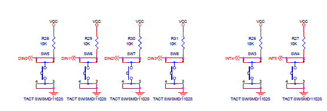
  - 스위치의 input은 DIN[0:4], INT[4:5]에 해당한다.
- AVR 메인 보드 회로
  \
  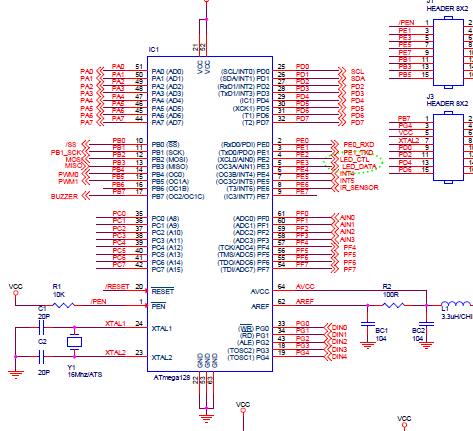
  - DIN[0:4]는 PortG[0:4]의 input에 해당한다.
- 결국, PortG[0:4]를 0으로 설정하여 특정 스위치의 input을 받아올 수 있다.
###### example
```c
#include <avr/io.h>
#include <util/delay.h>

int main()
{
   unsigned int i = 0;
   DDRF = 0xF0;   //LED 네 개를 output으로 설정
   DDRG = 0x00;   //DDRG[0] = 0, 즉 PinG 0를 input으로 설정
   PORTF = 0x10;  //PortF[5] = 1, 즉 첫번째 LED를 on
   
   while(1)
   {   if(i>3) {i = 0 ; PORTF = 0x10;} //한바퀴 돌면 초기화
      
      while(!(~PING & 0x01));    //버튼이 on할때까지 대기
      _delay_ms(10); //10ms=확인 간격
      PORTF = PORTF<<1; //PortF를 shift, 즉 다음 pin의 LED를 on

      while(~PING & 0x01);  //버튼을 off할때까지 대기
      _delay_ms(10);

      i=i+1;
   }

   DDRB = 0x80;
   DDRF = 0xF0;
   PORTF = 0x10;
   DDRG = 0x00;

}
```
###### 코드 해석
```c
DDRG = 0x00;
```
- switch의 output은 Pin D의 input이 된다. 
- Sw5만 사용하므로 Pin D[0]를 0으로 설정(나머지는 X)
```c
DDRF = 0xF0;
```
- LED에 해당하는 Port F를 output으로 설정.
```c
PORTF = 0x10;
```
- 디폴트 값으로 첫번째 LED를 on
```c
      while(!(~PING & 0x01));    
      _delay_ms(10); 
      PORTF = PORTF<<1; 
```
- SW5가 눌리면 10ms 후  Port F를 1만큼 shift
```c
      while(~PING & 0x01);  //버튼을 off할때까지 대기
      _delay_ms(10);
      i=i+1;
```
- 눌렀던 Sw5를 때면 10ms 후 i값 증가

##### Trouble Shooting

#### 2. Interrupt를 활용해 타이머 제작
- Interrupt
    - 내부 혹은 외부의 요구에 의해서 현재 실행 중인 프로그램을 잠시 중단하고 보다 시급한 작업을 먼저 수행한 후 다시 실행중이던 프로그램을 복귀하는 것.
      - 내부 인터럽트 : AVR의 내부적인 요인에 의해 발생하는 인터럽트
        - 타이머/카운터, ADC, USART
      - 외부 인터럽트 : 외부의 전기적인 자극에 의해 발생하는 인터럽트
    - ATmega128 board에선 INT4, INT5가 interrupt로 작동 가능하다.
    - Interrupt Service Routine(ISR, 인터럽트 처리 루틴)
      - 인터럽트 발생시 수행되는 작업
  
  - Interrupt Vector
    - 각 인터럽트에 부여되는 고유한 번호를 의미함.
    - Interrupt Vector Table : 각각 인터럽트에 대한 ISR로 점프하는 어셈블리 명령어(JMP XXXX)가 저장되어있음.
    - 동시에 인터럽트 발생시 벡터 번호가 작은 인터럽트의 우선순위가 더 높다 
   
   - SREG.I : Status Register의 I라는 MSB
     - set : 인터럽트 허용
     - reset : 인터럽트 금지
   ```C
   sei() //인터럽트 허용. SREG.I를 set시키는 역할
   cli() //인터럽트 금지. SREG.I를 reset 시키는 역할
   ```
  - EIMSK[0:7](External Interrupt Mask Register) 
    -  어떤 입력을 Interupt로 사용할지 결정.
      - 1 : 사용
      - 0 : 비사용
  
  - EICRx[0:7](External Interrupt Control Register)
    -  어떤 입력에 반응할지 결정. 스위치가 눌리는 순간 interrupt를 작동할지, 아니면 스위치가 눌렸다 다시 올라가는 순간 interrupt를 작동할지 결정해줌.
    -  EICRA : INT 0~3까지에 대한 감지 방법 제어. 각 interrupt마다 2bit씩 할당된다.
    -  EICRB : INT 4~7까지에 대한 감지 방법 제어. 각 interrupt마다 2bit씩 할당된다.
     | ISCn1 | ISCn0 | Description |
       | - | - | - |
     | 0 | 0 | input이 GND상태(Low)로 유지될 경우 발생 |
     |0|1|위치가 변경할때마다 발생|
     |1|0|Falling edge(High>>Low)|
     |1|1|Rising edge(Low>>High)|

  - EIRF[0:7](External Interrupt Flag Register)
    - 어떤 interrupt가 트리거가 되었는가를 표시함.
    - 해당 interrupt service routine으로 jump하면 0으로 설정.
  
  - Interrupt 발생 순서
      \
      
      - Interrupt 발생
      - Interrupt에 할당된 Interrupt Vector에 따라 Interrupt Vector Table 확인 
      - Interrupt Vector Table에 저장된 해당 ISR로 점프
      - ISR 실행
      - 복귀


- Polling
  - 특정 주기마다 작업을 중단하며 외부의 요구 사항을 확인하는 것.
  - 내부에서 외부의 요구를 확인한다는 점에서 interrupt와 다름
  - 인터럽트보다 약간 빠름!
  - 그렇다고 인터럽트가 많이 빠른것도 아님. 잉여 시간이 많이 아깝다.

###### example01
```c
#include<avr/io.h>
#include<avr/interrupt.h>

void init_port(void) //초기화 
{
   DDRF = 0xF0;
   PORTF = 0x00; //input
   DDRE = 0x00;
   PORTE = 0xFF;
}

void init_interrupt(void)
{
   EIMSK = 0x00;
   EICRA = 0x00; 
   EICRB = 0x08;
   EIMSK = 0x20;
   EIFR = 0xFF;   //원래 초반에 초기화 시켜주는 의미
}

int main(void)
{
   init_port();
   init_interrupt();
   sei();
   while(1)
   {
   }
   return 0;
}

ISR(INT5_vect)
{
   PORTF = ~PORTF;
}
```
- INT4 = 1이 되면 interrupt가 발생해 Port F의 값들이 반전된다.
###### 코드 해석

```c
void init_port(void) //초기화 
{
   DDRF = 0xF0;
   PORTF = 0x00; //input
   DDRE = 0x00;
   PORTE = 0xFF;
}
```
- DDRF : LED부분을 output을 사용
- Port F : 처음엔 전부 off 상태
- DDRE : INT5의 output은 Pin E[5]의 input이 된다. 따라서 DDRE[5] = 0으로 설정
```c
- Port E : Port E[5] = 1로 설정(Pull up switch)
void init_interrupt(void)
{
   EIMSK = 0x00;
   EICRA = 0x00; 
   EICRB = 0x08;
   EIMSK = 0x20;
   EIFR = 0xFF;
}
```
- EIMSK = 0x00 : 모든 인터럽트 사용 안한다고 초기화
- EICRA = 0x00 : INT 0~3을 00으로, 즉 input이 GND로 유지될때 interrupt 발생하도록 설정
- EICRB = 0x08 : 세번째 비트를 1으로 설정. ISC5 = [0, 1]이 된다. 따라서 INT 5는 모든 위치 변경에 Interrupt 발생
- EIMSK = 0x20 : 여섯번째 비트를 1로 설정. 따라서 INT 5를 활성화한다.
- EIFR = 0xFF : 초기 모든 인터럽트를 활성화(?)

```c
ISR(INT5_vect)
{
   PORTF = ~PORTF;
}
```
INT5_vext : 
PORTF = ~PORTF : LED 상태를 반전

###### example 02

- 해석해보자!
```c
#include <avr/io.h>
#include <avr/interrupt.h>
#include <util/delay.h>

void init_port(void) //초기화
{
	DDRF = 0xF0;
	PORTF = 0x00;
	DDRE = 0x00;
	PORTE = 0xFF;
}

void init_interrupt(void)  //인터럽트 초기화
{
	EIMSK = 0x00; // When changing ISCn1/ISCn0 bits, the interrupt must be disabled by clearing its Interrupt Enable bit
					// in the EIMSK Register.
					// Otherwise an interrupt can occur when the bits are changed.
	EICRA = 0x00;
	EICRB = 0x08;
	EIMSK = 0x20;
	EIFR = 0xFF;
}

int main(void)
{
	init_port();
	init_interrupt();
	sei();
	
unsigned int i = 0;
   DDRF = 0xF0;
   DDRG = 0x00;
   PORTF = 0x10;
   
   while(1)
   {   if(i>3) {i = 0 ; PORTF = 0x10;};
      while(!(~PING & 0x01)) ;
      _delay_ms(10);
      
      
      PORTF = PORTF<<1;
      
      while(~PING & 0x01) ;
      _delay_ms(10);
      i=i+1;
   }
	return 0;

}
	ISR(INT5_vect)

{
	PORTF = ~PORTF;
}

```


##### 토의 사항
- exapmle 01
   - EIFR과 Port E는 완전히 다른 비트에 해당되는가? Port E의 output이 INT의 input으로 들어가고, 이를 통해 EIFR의 원소가 결정된다.
  
   - EIFR와 Port E를 1로 설정해두면 초기 인터럽트가 미리 한번 실행되지 않을까?
     - Switch에는 Pull up과 Pull down 두가지 방식이 있다. 
   \
    
      - Pull up switch : 버튼 눌리면 High에서 Low로 변함(default : High)
      - Pull down switch : 버튼 눌리면 Low에서 Hgit로 변함(default : Low)
##### Trouble Shooting
```c
ISR(INT5_vect)
{
   PORTF = ~PORTF;
}
```
[AVR] 코드와는 달리 INT4를 누를때 interrupt 발생한다.
- Schematic과 비교해보면, 저항 R27과 INT5가 연결되어 있다. 즉, Board의 INT4가 Schematic의 INT5와 같다.

### Day04
학습 목표
1. 질문

#### 질문
 조교님 이메일 - d7000@konkuk.ac.kr
 - 초기에 flag register을 0xFF로 초기화화는 이유
  >flag register을 1로 설정해주면 해당 flag는 0으로 초기화된다. 임의로 초기화는 불가능하며 순간적으로 인터럽트가 X상태인걸 방지하기 위해 해주는 작업이다.

- polling과 sampling 
>edge를 감지를 한다 -> sampling 을 감지. -> sampling을 어떻게 해주느냐에 대한 차이!
sleep모드 사용시 일정 clock를 정지.(전원 아끼기용) -> I/O 클럭 일부가 죽음-> 어떤 애들은 제대로 작동 불가능

- sampling vs polling?
> sampling : 언제 신호의 변경이 감지됬다고 하드웨어에서 감지
 polling : 언제 신호가 변경됬다고 소프트웨어에서 감지
 interrupt : sampling 기반 
 try catch : 에러 처리에 대한 것, 인터럽트가 아니다.
 c에서 event listener : OS쪽에 등록된 세팅. 인터럽트와는 다르다.

- interrupt 사이의 우선도? 
>INT 0~7까지 순서대로 실행
 reset : 최우선적인 하드웨어적인 인터럽트. INT 0번보다 먼저 실행된다.

- interrupt가 실행되는 방식?
>하드웨어에 대한 인터럽트는 그냥 PC가 넘어가는 식으로 실행된다. 이때, jal에서 링크에 대한 명령어는 ISR쪽에서 수행한다.

- delay 함수에 변수를 넣으면 안되는 이유?
>delay 함수 : no operation에 의해 구현이 됨 -> 컴파일러가 변수로 넣으면 안된다고 경고를 해주는 것-> 컴파일러에 따라 다르다. 

-  switch의 민감도를 조정하는 방법
> chattering이라는 방법이 있음. 기간을 길게 주면 동작에 대한 고려를 해야됨. switch의 물리적인 특성에 따라 시간을 다르게 보정해야된다.

-  공학은 어떤 학문인가
> 디지털 시스템을 구현하는게 핵심이다. -> 자신이 원하는 알고리즘을 하드웨어로 구현할 줄 알아야됨. -> 자신이 원하는 chip을 만들어서 실제로 구현이 되나 구현 -> 실제로 그게 구현이 되면 졸업 가능.(or 논문) -> 디지털 칩 시스템과 인베디드 시스템이 핵심 유형임 -> 8대 공정 

-  베릴로그란 무엇인가?
> 하드웨어 자체를 설계하는 언어 -> 메인 메모리, capaciter 등등

-  HDL?
>하드웨어를 설계 가능 -> 수동소자 자체를 설계를 하는건 힘들다.-> 하드웨어를 말로써 풀어서 말할 수 있는게 HDL언어라 보면 됨.
베릴로그 HDL은 실제와 거의 비슷함. -> 어느정도 배열 시스템지원

- flip flap vs latch?
> clock의 기반이 되는 flipflap이 훨씬 중요

- FPGA?
> 병행 기능을 본인이 직접 짜야함.

- [idec.or.kr](https://idec.co.kr) : 베릴로그(HDL) 무료 강좌 있음. 원하면 회원가입해서 들어볼 것

- HDL vs VHDL? 
> 하드웨어를 작성할떄 사용하는 HDL 중 VHDL이 있음

- FPGA(feild programalbe build array) - 리눅스 올리는게 힘들다. -> 정확히 말하면 게이트들을 잘 연결해주는게 FPGA

- DE1보드의 경우 arm 코어가 옆에 하나 있음. 거기에 보통 FPGA를 올림.

- 디지털 설계 방향 = 실험+응논(김창범 교수님) + 마프(박성정 교수님) + 컴구(박성정 2학년 2학기)(+물성+임베디드 자료구조(?)+알응(?) + C++(객체 지향) + 제어 공학(굳이 추천 안함.))

- 아날로그 - 전자기학 2

- 디지털 설계와 반도체는? 반도체도 상당히 갈래가 많음. 반도체 물성? 반도체 설계? 아날로그 반도체? 등등

- 사실상 아날로그 물성 반도체를 포괄해서 반도체라고 한다. 진심으로 그쪽으로 나갈가면 반도체 관련 과목을 들어보자.

- 인베디드는 완전히 반조체 과목은 아님.

- FPGA - 병렬 처리에 특화가 되있음. 똑같은걸 수십개 동시에 돌리기 가능.

- FPGA에 멀티 쓰레드는 사실상 효율이 낮은 작업. 하드웨어 논리 게이트의 속도가 너무 느림.

- FPGA는 보통 Cloud를 못따라간다. 해당 작업을 연계하기 위해선 상당히 비싼 FPGA보드를 사야한다.

- AVR - 16MH -> free scaler 예제를 참고할것.

- 전자회로 2 - 라플라스 변환 공부해둘것.

- time interrupt+ 7segment -> 한바퀴 돌기-> 하나씩 쌓여서 네모 모양 만든 후 다시 네모 모양 하나씩 사라지게 하기

- timer - interrupt로 clock, 즉 시간이 지나가는것을 interrupt로 수행

- 라인 트레이서 - 하드웨어와 소프트웨어 모두 잡아야됨! -> 센서를 직접 제작 

### Day08
학습 목표
1. 타이머 구현

#### 1. 타이머 구현
1. 레지스터
   - 제어 레지스터(t/c control register, TCCRn, n=0,2) : 동작 모드 및 분주비 설정
   \
      
      - FOC0 : 해당 비트에 1을 쓰면 파형 생성 유닛에 즉각적인 비교일치를 전달.
      - WGMn[0:1] : 파형 생성 모드를 결정하는 비트. Normal, PWM, Phase Correct PWM, CTC, Fast PWM의 모드 조정 가능.(2번에 각 기능 정리)
      \
      
      - COMn[0:1] : 비교일치 출력 모드로서 OCn의 동작을 제어한다. 이 비트 중 하나 이상의 비트가 set되면 공유하는 범용 I/O핀의 기능을 대신한다. 이때, OCn 핀을 사용하기 위해선 범용 I/O핀의 방향을 출력으로 설정해야된다.
         \
         ![COMn](data:image/png;base64,iVBORw0KGgoAAAANSUhEUgAAAQwAAAC8CAMAAAC672BgAAAAh1BMVEX////n5+cAAACXl5f7+/v19fXx8fGlpaWysrLX19fs7Ozm5uaKioqsrKySkpLc3Nx9fX3MzMzGxsZeXl5ZWVlmZma7u7vg4OB3d3eEhISdnZ1sbGxjY2PLy8uAgIChoaFTU1NMTExGRkY6Ojo4ODhBQUElJSUuLi4PDw8jIyMcHBwYGBgLCwsKKDfSAAAgAElEQVR4nO1di2LbqrJF4Y0ACSQhHno6cbPPPuf/v++Ck7RNY6dud9Om+3Y1TSyBkFhGw8wAAwB/8AWQnKYWAxAdAAw+nBtNg8bmMQOJnqKLlzsfzKmYj1nyh9pjtPCHQ03OXTZ2PtYaOAW0hgAtBmDfAJMeSqHNuWt+BojvCTegVEpPgOc64LuBKj+Eh/TB4dVhSwS3tUG14UDYivCRzCLTJ3HV2wqMqq2NAQ2oVK6QueHjjQPzmGndKz7jUg6fOaitINxmeuYWSJbGLtXdcieaGwXqvyII/0W5eGwGW+UyfwlC4tOe2m7x2q//+yABSb6r612eUvERAyQG1wYfuwg9hUrCXvfmMNzWwFsAYC/Rpn3Qq9oqmToE5i2ukwtMxmR32XdTLgfdu4EGF8LAJsPcTlO96jVopQcXEgX1nszQaRrp4nq5Tbv4JWS0Q0ztbfJskx7uMoJamw/Lqjt+aumJioX12HtqEvd+dsG7PUCyz5Dkt6TiPfTjQUnNZrlxLz0A1vskWVfFNpB9itYRAtARyKRRGFaxc+umRoDcenIbCvm+cAXj5u7dloxtk0jJm+XXkOFYBZ1iKxQzA4yWRgw5ohEpVpIRkwZwyTkXrrY+KOBWR/MpXbhqZBRojYrAzFbORvlKQGV5fqeEdsBCiikFuSSkgK3nwBuDcrG1LUVHgihywvHycjAcEcMrBRVchZX2l3DxbbD4Ugp/5asUF696Xxibb8J4Mf/llJz2bTf56agfuEA3f3Bzsz+2DBi5eUKWC4//y5/823yWZnb+eU7zPOdnaYb39uG0+RwPh1+efRfg/SMZzF37QvVfz/KI9JuIiI84Q4bwvSQqpVndY3pXB1+LHr+8IoNPPQPr4EW7587S+LbRiX9KTrlHMsfkn4nUtWRAK9dvUJl/ijNkBAmsOgD8YfmP2++gZq3831ky0MFgyzbgBv8/lzbPYB9s+pSzkGF7kLTv4tq3dejplhJLflN/yeS6je9p+DV6xHmcJ4OqAyL3y9CHPpMh8R15eUUmYzdEuUxG8r7zfSajO0tGf+sPsveuE+5WZKWukXpzXW+V3Jvts5b0y3GGDNJuELOUjKKdSnVIFbn4mmwO0MmT4HaV9dJ21Okz4+rhNZlkFZJlaal05yYks36ZlUvZmjTUQ+3fORlXXvF1pLOWKvL11SX8ZHw7Gd3VZZ8n4x3jiYzUh+U6fLg2Y7hvr8z5ThC2RzLepGX8bnrGU9XeTGZg8KV/7LK/7AH48wwil4HEJ/8Zfv3qr5X9Ol6TGVWcX7nic1h4Tl0oZNT3IhhcASGwINlqJYL7XLssQyuST4byAYN8jOqchmtsKRM5P6lKvZCWUtUBLrWN+Q6oGtZaiJwIHrKQSgBclwNZE5HLGMbvZgK8SgZKlTzDxhkyeBDTme+kkDHuaqEysn1dU6cTSR31gB+UZlGyW3ZvwRo17XOWqHxY4LCk1mmoNrjkEpwEYJiKlwOOCeCgdr9OkkuoShattzhYnQuAbodRW0gP/6ineo2MCZ/zrZwhwwTUXyJj4HeeZQ7w6vzYRZb1UZAbxzQI5luQFZierEmD26PsUqPZBuESFNm6astvhPFYTK0DLEQxgWrKlzEo9YolrbpJpA3D9ij/B9GY/OD9BN6sZYAxuDNVPPeauHDuIQoZQgPJqa41diZW0C0RroDfSV7ptVnBakEjmdu1YbJZaxZgbiMjlaMW2qj8/i2yAatniMmxNJQ2zlJWOV3lLCRKzGaVrw21iqsWPHhn3oiM16/4Oi7qGTV7ftycvTn56WbLU9UUI+I6bPjKjHgYL5RJyOvHr519Q+AnMnyK8DrcX5sx3uorc74TxO2RjD9KF3h7pWvk/JMd++QdHzkCiH9zL3iS5m9p5b0mQLOcv7I3qfWl3sSmyWU6iOHC5N5JmFwihHThUmlnih6DTI1P41QNLz+cjxxzg9FcZb6q3DlUfB5LEhpMzfHRvF17e03P6K7VM7IGcM4tcepNnHIrpa299bb3USsN6g0AOsHcQLJekHVHp3WSDLjINKVwX1PQvZNK7vzgoIoA6nyKhoH1WXmzm2q/v7ZfwasaqLhSAwUgXCSDUW1tyOpVAin5TU4Ad5z46LGLCQ8CTFX00eU6syY5kyYe1OKxD+rWeH4bJNCzkTQbldRrNs69uP49/Va89poIeE6DOfss7txo+YkMbhBViKYD9QfWOFiX2Q06N/tFobG8XSK60XIDkFKYUcKE42qH9RiZccBljcTWleNGMTc7t5Kc6Xvr+lX8pKECrhqurvbwkV80wvpUtRgbfh32azM2nfn0+YQrL8zZr875I9E8kREWdiVu3ZUZ3a6uLfOdYHsk44/SBX6Cp+u8o+ufeaTeCq8KUHPO7DxHRnNOOzuRgXUIVfqUimAIdRUWjdw5N9pFkPJ86zdd8u14jYz5wzn5f4aMJnB/JmchIypQ173Rskq9u6WAUlB3LQejdJQBIRfbtzIrYS2lC43TFAI/eNN2ppUuSAGkn4LMikd75DJMPr2pWf9qy1iuJGMOYD8jHwoZkGVNo59kSrSVKdc6k9P5Bsx7bTVwlPQD3hHawNwD761veittgC311aQ3C1qexj6qJCV1yM/+n/huvopXyThrcZwhA9FwrgGfXhPYSuFdMKyVIRQXb1tekzaOUlc5NRiP81vEWsYCo7Mc/XwMuVmsQbhAMdCNrH1cgk5cS2nkm04N/UFK11mB+FyAPvv7+dzZp7+PHzl8WehPkrdvOrz4u3atqV/a6/AhXJlxub8y43vBsj2S8adlgJ8xvPipM0TlI/6+ofmfwutrMgOrc736OTIwu2TCWx0jwgJllcG0WmIVAq1g6bIFBuLEjnj4Of1C5TTBqBRHyilUITUDQbr6JwjR18jgxyv1DMAPl5w7zjM7SsjuDZqq3IOmMsgmfA0clOywOFBJrWRUm5xapn1wfhrv2BohwMc4hVXqNEUG5W18OwfXR7zam7TXknHZ0zWbsfNdGyYCWgNg9KSCWb0aQRLMB6OBjUivqO/HyUjJW6gOZhK38ojxAU08Sbcvc0f4Tva3bxqvkrGec0WfJYNecgjXOrAa6lpbIHSb1dFFcp4bBKhlbFbOAFrDaTix0pzJjhmps2bK5AxwwHpcoZQx8qAkkb+YjFev+Dq+eRoT+0fDxv8cT1WjDJPrsF+bEU/1lTk/XnFt0W8DvD2SEfUfaPqLWuQf/MEf/MEf/MG/HJXhJpuKONsYiJ9TfMuK7MsY5zOae53t0EefJf6Y3MzzZ3om4rNBDSI1qOuctfznOF+FPrvKcVr/3MFX3t7IXFvzVzaibx5qYPfJgnl/ePRqoPrccMADVsm8Kh/UkwbOcj2GDcT/Pjgi5qc1OeieskdWEUWgurdx6Rt6jyZ4w0F3C/CNAurmwSNgyx05HQ9Y/twFCvWN0FNr/0p+/HuUnUZA3y0VSf97eHSqARDN0vK0JBnGLii+tC4FK9tshvcI4D0JB/+rBxkNRN0tzLbJVOtbArMR7723bVs4RsdVcd1GuyzwxoBqB3xiLLR2s7ewOnbZcp+QP5iQLG9TyxbJVtAj/3OnQY43TaI3+p5s9N7dpH7MzVP6Nv2lTk2WtYBQb6ptQ1MzqQF0LOqhJ3KQGpBJgLHfa6UTP4CgW9yXhXtJJ9m7FnT9aIb7YrMWMixvpLq12Trdcsu4k5qMd5ofmfFtu3aA9FHqdMitZDLzcAsTpxhVbzcn4wIZ5rh8kH91XfP3uKSAAes6M9q/6H35VpBMyXHvXY9SM7DbsLpeTjvmbXm75pRSo4eOBnkMuunbXuaW4eeD6UXwq/X5O24V0AKgAwHjpjfVdq43QJR1tWhz6APn0t02hYzmZpxsmzI7qVVLOK0jeJ9jsw+oL7qdyPTKZe538xD/AVBbfxW6H5rtnWF7DCKjbqbuCkx/X5Or2z5cVdq7w2NgADRc14LS17NkiJ/gyX4LPA4ioU9yr4kWVcphEkVDiWP488ghw8ePBhow5mwCiiYi55D5NMpSFWWphl/MnLQn9W0UV3tbfzoefaCfyGhuXUs3phd+o/Tfq5dQf/ik8Xwkw/Uusc3FZG5UuHFBxp5+bDYnMtzBHkanCdcNUIpQt1hFZ/7f2CKaSabqp9Tvm/CCjHUCyB1AfT9/kPK4rM5Xd2fIaDXAawL43t1Ohz0odkzi48jGiQybgE+73KckoXTmL5XckR3mWzf5GNPuzo5Q/Vq8IKM+6I0N2kN+3NqDGrwi51rGvOnd9rGVc9+3x6xvs16Gp1wPLeN+7dn9tsj+TibJ71Fiu+zH+9ivqdUHsb/pJJzvwgsyAJ6rbEw22XSsqwaN/JkV+0lmiDnbpHwEeBwFB2MDxKdsJzLIPGdl0yCcrdRcXM4jbpnIH5sSEo2j5v1pYE9kXNubXKUXX+pNflE4tqvxSIa5VfQKqAO9Ip+C+/lc6qqb/DKo7YEM0pPqCohuFFfk4umq0t4byEuZ8Sque02qy26gd43LZJz1/g0vpd4ZQXgiw0Qwf6F1fX74smNF/PM1xbNcCWKBgerBY7heMnnNw0XrD7DyL5KBtdIvy39JRqT6hRfqRIa6s1TZwGnufwOMY6BQAbzIkQdnpf67ASZYG+SodBXWpqXu76GOsQ6hzH2cF2L8SjFjETqQWTnCWVIR9Rh1zsLnRROlRSPjfy2Xxsm7H9A5XSSjmUD/Uvq/IAPvZRLKOTIolT6rHv3EewFdUuvm89e8V2kAvqViyHIKZPVkvJFr2wlF76rkkzW+O913pQD1Xe7gBzOm3ExQn9ZApRXJ8Glo/MqkX2g7oWYfe3cYQP+WZGC4Xtcy1pdBYB/JwHdUrzE1PYnO63boGRBHyCCVmpFNIEg19DEMifV1F4982hmErAMTGwFpY3B8id7BMs8l0GNSYVBaU6jVVPvVyXIhjGvvBu/0euv++eThV2TGuSllZ2RGfUFmYAwwKlExEMkfCKpImb5Wgp3WKKcJDNAI6CqAqAABpM75SpiN/BmXeqE658QjepwFVwuC6hJx4zE7xrjkP5WFqpKb/POm8VOVLvC+nZlPZNjrVrhfubxdHq9dL/+u8LQWHne5WX8dYCDo67nQ6K8q7b3hFZlxFtfNgP73KV1ncUaAnsGJDOHceY/F+/NjPOEyGW454597SQbvXg45n8iIoQm2YpgzUX67pkG8cVnNPLxbIXpZ6RpA93KA8yUZqHv5TT/oGUklK+3QMRhsm1TdOh9dp/lPmOr7nbhIRuXrMwLizGtyJkDCQ8vQIoS71kt1PLZpaIDu6W2bYH38/cgAFT3jizlDhn05W+BERtOAJr8XwKiRq8qQssLd5J/r5yL/dPxspetd46PSpeUV0HfX5JLL7VWlvTfo7YGMH9sy/ugZn+HfSMZ1Vit5me3BarW0EZ+v/a2pw8SpGqBvm6BV9JjnUrouC8FoA2rlMHhMQQKM67rWhs7ArfS7gjZdJmPsr1K6mFxfnDuRASnXbkHQoMiAYqjx3MnFWSi0NAAohajOdzBaYOoEpYw1a8Rc14wiR7PSt0am8MrGv51yy6LLXYw2gCn7H468497lEqmTKwK15PRWYH7LKWy023jTfU///UrLiGcmUl3v6cIbzo2jbe2g1m0+jIBFALZ8O0wVOABo57DhvuZBGN9Q31LaBth4GFPHWVQaJKPWlsLeTi3n3ex0boSJsVXRJZWJcYClfKrZQBpBVIe59GAbygfV0AX5XSO5r5FxpsCXLSPY8KJJPmig0eXvLqUUQ+/KXLbWUq2VCrnBQMCoij3o6jG3lXyspWIht5stxKEXbMsEpzGf0n5wk2es51ZygCUddB9cj4GkztvWxShtS4Bfd5tlOzqgWdpl3sbv0+teIaM6M93wjDpuX2Z7EKDcYjxiWwHTlMmuuZ2UiaYGgbFIEsOzxdbkFm5RzoBHIWrlDZp5wxHgY/7OkRAjydeOtRlHTHjMhObSclrZQ6XsqVRKPN2fzI3g+GQD1rYGZ2f1fgMZ70Hpwr969PXj8CJTV4Ad6DXZ4n5NrveHRzJEf8Ww4Wl48ZpsPF1V2nuD+DO8+BleIePcK3xG6RKXlC51mtNV1hWMUTpgNSVg/KY54Kc1CevTEYqfJVmpMFK52OrRts5CE7ZLWVA88vZsuMqv4xWl63iNngHsh5eDNw8zd/zIsFb0AyGJk+iDsMZFPYJGOi7bGRAYa0irIKHO5ymGsmmZK6FtvKSSmNbGexvcMcASdkVpvuNI8Sp5yzIXxIaoiGJRzwBrXd+WsUtVpbHyOoL2u9ZkvNIy1qvIAOmCc6e2kAbqoQe8RAO4YQDVPWIU9CjXX3RAGtEZW4YTm70nVMKkvfVqAGizgap13bgfgNmLIlU2dps7SRcZvZwQyLor6foK4L4xS255ky17Y2g35l5xaXepv6tj+sdK10VPl15V1qC8y5qo1qufZf7PSsuAVNJIOuD0ukaoMhn11lPd69S2vE8rQP0s1ZLibrqWrjvIqjfgMto+TrSVrU/lDlQ6E1Z/ahkmeVU8tvmtgTpCGl880T8m4x/KDDSOp8VIZZSyaspgIjkd51ZSxijESavLx+Vf1RkCGiEIEEV5FIhgXNUCVXjMBhgxWUsTNShloaydnVY5FOlTMp9Uw0qQErSkjDDW4/frK+9E6XofbtEnT9ftdcOL91eN08nb9R+N8/0ixKfp0leMGmYge1U2MV9X3HvD+2iff/AHf/AHf/AH/zpghJ4W017obV/Vca/votHZci4U/lGx/hhE9MUDjpg3P1g/qNP9sUzMPWYrwD8GJaKra1b6aKCb1F7elRxB357cDh+DIaBil9w1oHs09tonO9/ucmm+9P007dJ+GaKrlKA2GWhER86D16D675jL5IDdPVQ+FHcJX91ufngUpdu1iiu5lxGnlUCGAblprT7qh+qhgwCWG80N1Q4StypkoeWr5dBmYz8z0eYPTN9auhJGuPxPNrxuWP2B4lVhmw1Qq0/DK0yCjW2rI+q0HQF2MNPUzaCZR8kQpUxxBSserPpPXcpNapm7fM+0kfWmAc1/IhjuSLl97G0uk62oF9dH5bwSx5WF22xUZBM5dnd3K6g0PCjaP+y4Sw7ZNJwTST4yz/QwqyjVQfvmQ3tsQMjm89ovYKdtjKZNTWyzFcz7NnrazsxPZGp3vxde3e0S+F71DOokJVR3Ppv4+5gt06Fi+sA7l6Z08ILZXAI9LBJ7b4MXfmFL1wDe+fw3Gbd0+VkO7W5XxM0PX/t3rwe/+Xs/rUOEyVswJt1rPal4chrJwIY5ufxMdplDWiHb6d5CnBzFOauiyfXuznUwqNWvSW4I8Gmd4gopXL07wuB42bmFZYO26UEnPdx07FRb9qlgLfNucVrtqOMxOtM6zXcCYvkm9AH4AXTmng08E2xu+K4ppN7tMjiJa/QGm+GYipixbJgAmgqctu4ZDUJ8BObhXtxiICypCB5JPajcYs3IBSCnIWFsTa684ahEbixjO2VIB52GhspoEcnJowU8f4MkiwKUL8amaSo3nsaQsnhxVb7qtJANlwuEzdeJB/8maYAYQVNKK2Wi/IAPZXJUu/ew9evlYfR/geVHfvXwzfvAgxeZ3/xBxqPv03NcIlB+gXImn47uXOJjBqMRefz8GEiSkMfrTmfJp7NffMZfS/ni81sXgcWj77M9SaLiri1bqdb45HoFj5ohtU+JpMjunEhAWQhykhynAPKi+UKSPY7siF89lPxNeHIEFwUQ+bSxmEISH7y5YdJHLE+e3UJGTuyUG+Rg75f6JqgUWOpKn8NL99elFEqAraoBiBNccU9qjr2jDhmCG/57cII/I4Pf5Q72PwhMaj8sf+tNHGp/UpwLGfw+t42jATod2/U+9HW3W12UnQcyOL5bhsFsnU0yxA9wt7dte6AhDrpzfy+/x9jr52RURwv15vjBZG1xisklwE5RIAoZ4t6uutXjBA9+D8vCUpt1KfBIRu/ctu+3NjN15AwGfGs3Nw0uyAPvWTfe/roafgM+JwNwuWKxQg7iTBnnMitcpxHGk8zgehWYaUuigbOrpBHrKYLXiQzV6rqGc07P9os1Dsf5Xo9OOWOCran43iGunwv8TIBeAH1tFPfTDhzP8LPDjP0IPAnQZKr6EgRk4mJiZcPZxOryJe8V1fhABtnjZb2MpfCK1qanqyZA/Q6g17wm6rXXpDn/mvyO+FzPuIjXZYYusUKzevH89OfhAs5oGfjZSjWerU/8KWxANV5avPxQEn6jwPX4HBlCP9+H6RkZGD7fpKGQQW4Y6bAbhePWmaxoOTTkrshZZGfkbMfKht+1YzWwFjk+O5zUiq3F7hT6QK5WUu9WVp82jXIJuoZhwSrBxOiYsC73Y9m+d82tmS0Y4RupLWfJ0O65l/IZGYyK7QUZvc6CxUid+M6SpjApX4PBsZ0xfWgGC4Tnw954qlg8GJ1YyybtqOxZCTO6FTpLA1v4HMqUY7n0wS5GeR7ayNLmfLSB5R5901mE+bfavvYsGYy6Z4LgGRlZy1i+JENsKHUtlxKSji9s8RKmESTrjs7JDvg5kzFOfVZo9z5MdZJUuk5atfjRjwAFxqEMXK2UMQWCCaGFdJ+4SmPrbdMPou+7LUIzd2nrY8u8eJPAsWfJANY9c9E8lxmGPZMBJ5nhQG2J4jVHVpiRO2ssBsPqyntgAc/XN8ocVZ2PhQM5eXTlHSGWlPnx2K0GVCrf1LmyeEJxw5UZVV3Tmtckv062YqbceDb50XLat2+W/U1kfLfSdbk3+XKu1/nFve/IhnvsTVDP7EXMC5wvp1J/KfHL868U8j7gHsmYmLmMEF9JVP6VxN8L9q1sk98RP0bpAuiXr474ETjbmyCnntXtORn8+dK1k57xQbfxtDEaKXuiEVICy1QI4Pm6YKrvBGfJoMzqzzM910Dj8/mzJzJ2Yb2F2iXJIXT92jZhjdBqeeX00veBCxoov6yBgvp5BU9k3DO4bHJfodZb6AZku3grD62rf38ySNTP5OlzMqpnreZEBg4AL06yMUgeNZcY+cpJJ+Ii3+ax3wYfyXgtOuX/MxMeH/QrkSHT8krcSNm977iW34D4ye13eekWZJeXnAkrf8v1aOcw/lG6PuEHKV2gLqtBPkNZCYLG7wuT+9E8vyaAwOe3qD6518iIi8fs2+ZHnO1NsHquVz0nQz3vak4mvI4Q9rjJjBgs8iO5hYZGrpI1oVybE5riOxO8/NRccER4BbIhPta4jD3WTcUBMYBFzFFyp/h/Ve6gR4BygbzE8ANEnIYpEReACyzKICa2SxybfOVpco2DSuOqEUMN5nZtRyq1HGWpyjiCsayCJuW+KJfHMco3rziqx1Lea2QQ/bzpPyPDrfUzrauQ0UxlZSyj2oY4BS/QhoAqy/bHCaQGUKrXTVMwSpX5iRPsIYzL4kLPj0wyjdC27lHrVtJBMpdoR9BADwr2EZZQl7oXoBdU7ywgUFbTM6mjUlNMrOu3taWtu89VndvouFbwrsm5gZmGsnMKkQa4GNfDKoGQbA1Me52vcSm4AIdNRRWeWtcF585zVeI5GbF5pmOfPF2d4LqbUlY92WHJuReLA2yJ0QmnEfhR+TCHXKzQUaQ09txHJuHau67+sBwI2qptTIEm61syD2SrgbtrD00ap+Oyd/kv6EaYC+vkmup5E9rHqAbR2zD1tVoWtAsErK27dvepy4wxEteFN7CrJAfazmnIXyH3hLY4paYfexfXdWHHjhz9/uRoOU9G81xIPH9NXHwmHU4yY5SxpuOqCI005iZLaP5CeFjxWCY8ishGNrps88A6/yhBKxc7N0ZlKbJl9SslVDBGVZNV+JFhSkBNDSOqcgZyVysCTIDuVueiG21H6EiEPN9NrJASY9dwcBUQq7RErZXi+UUvK14hbCroytOsFRWqfMljKb8cuF1hSFeIT3M3XyPjC1whQL8Z87e7+8nFmFYWfnNg1PFMPPwfTMaplI+zMudnj8guWvn1+D7C/f0YMrCEKjc4zW5Zo90RrqhSxs2tVzi/VBHGbNzHY6PoSDnjbYTE6sbCURFFI1QfHIOaCfiTN0t7gR9DBtlcWFmMXeIDtgecGiT9QbcuyEDDVi0GwCwbWePl0MlDE1uJqRRdEqmb2eKVHHC/mOkXz+r8MWSIskS5Tes2uaDWQ+lO1eS1zmRMSe045O5N7ypSxrbQpmrVUlHJoKRbx13oYkigZ+vOf22kux8kMypECB5LbA3EcVUWQSNxmj+HRJOVxDLPLSs+ZTGywMUVhkmTNSCAmlogTGpBRNbGUod/bdN4ImN5Byb8uWjWPxWPtgk5yssrnuPkX0kM/Q8KnhzjL47CHPVjy/BcXASJjFxOtPJy4m+G+o8J/wk/yITH80e1CZdNbivzzVuKnhaffXyKr+unCH8u5hqOnknfujxA843xus5PVoHPp+o9IwOpMw5hb5VDVmgJKs9WaKVrGyXHokKTusQqA7YBlqN55pxYi4jD2NTNXLibuQGGi41zUx/KopaxFs2da0BONpaUOUF8nEucs9qhypUVJ81seWcddyOwc6kwpEzaFliR7yPmbOZJt/Bsy0l+imtX7lA2g6scFg6NtrGkxDtrHC6P85HE8/4M+ooJD9zLoQIApR6zVuE1KNujdf1YlvuRCRBvFr9OI9COBbfKLkoffDb09eAGpnNmvsfFMzm5DVLnNrYA3nZBH22Xk+PuEqh60CfKIhlbSxe7dKLrFQy9ajfTabVlnb9E+sPzkp/ALRtMxeAHvCvPecB6BkqpbP4voA42tiYkurHkvGRy7TenmX9i49tN+OKj+JIMIglrD7LNX4PxFU+aEhlj44HIJvxgPAeJ26FhXlqqk65Sy3YGad+GbFa7CLX2bICMu2kcAGq7HvYg+W7xXbUBsYnNW5Mg81VsRZqavm9cpq8dQLfMiYtcC94sNt1KP9ld0hIhR0AVDJepziY8tNZP+bEbL2JLUuLFhIfZhG0MVtMAAAG6SURBVHfHnhxC/7oJ/4VJ95wM8nJ4Mf9SuF5RMZMbSHFupgbYEhpz1ONcuaxmrRZRV9mRm7Wn2ChnZuSyaS7caEyj3GwtY6RMZQF2dBUD+aMSDLOTB6sNpbUbSDgU9aocGQ2z1gHXTHcjK8N8UQg7FoeAU6VursRooqvAMVcFMZVf1xJuE4pcgBX5Rm5ziCqmUB0/VvYXmPD1d+xDYi6ZcEh959Z0557iB5Nx2p/oo8B5Hp5/vWiTmuZfZcKnEAOxnt4x07JjkLnx5f6lTZAoWWXTFYNK3paRRz2vcy/bii2GhdxkIZRL/I9S7bJWMv07TPhstdJslGYTvgNmBycT/phNeNm2a9uTbLXqsll2nWA3ZZN+9RJQiftiwmerNfcmCXSeD/8OE76btQoD7AanYdyBbwAbgs76BkzJbTiL0zkcmYbOdVJmEz53xUpHqvU2cFc63EyG0wf+a5ci/CCZQRBGSGTznBRr/rS4FZdT+DR35XRcdjsS4PEkKtsY5R9BynFZ2gcw9wl/s976Q/GeRuF/+UyoR9tE7EFfBOzT5UTd7vCV1N8K8mmKDroMMIpXUsn42rW/FwD4P2EFrJFSeUMPAAAAAElFTkSuQmCC)
      - CSn[0:2] : 클록 선정 비트
     \
      
   - 타이머/카운터 레지스터(t/c register, TCNTn, n=0,2) : 실제 시스템 내부 클럭수에 따라 카운팅하는 레지스터. 비트를 조정해 0~255사이의 숫자로 시작점을 바꿀 수 있다.
    \
      
      - 만약 TCNT0 = 0x06이라면 6부터 카운팅 시작.
   - 출력 비교 레지스터(output compare register, OCRn, n=0,2) : TCNT와 비교해 OCn단자에 출력을 발생하기 위한 8비트 값을 저장하는 레지스터.
   - 타이머/카운터 인터럽트 플래그 레지스터(t/c interrupt flag register, TIFR) 
   \
      
     - OCFn : 출력 비교 레지스터. 타이머 TCNTn과 비교 레지스터 OCRn이 같을때 OCRn이 set된다. 해당 ISR이 실행되면 자동으로 clear된다.
     - TOVn : 타이머값 TCNTn에 오버플로우가 발생하면 set 된다. 해당 ISR이 실행되면 자동으로 clear된다.
   - 비동기 상태 레지스터(asynchronous status register, ASSRn, n=0) : 타이머/카운터 0의 동작을 설정하는 레지스터
      \
      
      - AS0 : set일때 내부 클럭 clk/O가 선택되며 타이머로 작동, clear일때 TOSC에 입력되는 클럭이 선택되며  카운터로 작동
      - TCN0UB : 카운터로 동작할때 TCNT0에 새로운 값이 쓰여지면 set되며 쓰기를 완료했을때 자동으로 clear
      - OCR0UB : 카운터로 동작할때 OCR0에 새로운 값이 쓰여지면 set되며 쓰기를 완료했을떄 자동으로 clear
      - TCR0UB : 카운터로 동작할때 TCCR0에 새로운 값이 쓰여지면 set되며 쓰기를 완료했을때 자동으로 clear

2. 파형 생성 모드
   1. 용어 정리
      1. BOTTOM : 0, 혹은 카운터가 0이 될때
      2. MAX : 0xFF,혹은 카운터가 0xFF가 될때
      3. TOP : MAX 혹은 OCRn에 저장된 값
      4. PWM(Pulse width Modulation) : 펄스 폭 변조. HIGH 상태의 길이 W를 조절하는 것을 말한다. PWM이 클수록 한 주기당 평균 전압은 높아지고, 반대로 작을수록 한 주기당 평균 전압은 낮아진다.
      \
      ![PWM](data:image/jpeg;base64,/9j/4AAQSkZJRgABAQAAAQABAAD/2wCEAAkGBxMQEBUSEBMSFhUXFRUVGBcVFxUWGBIVFRUZFxUYFRUYHiggGBolHRYYIT0hJSotLi4uGR8zODMsNygtLisBCgoKDg0OGg8QGzUdHR0tLS0tLS0rNy0tLS0tLSstKy0tLTcuLS0tLS0tLS0uLSstNy0tLS8tLS0tLS0tLS0tLf/AABEIAMkA+wMBIgACEQEDEQH/xAAbAAEAAwEBAQEAAAAAAAAAAAAAAwQFAgEGB//EAEIQAAIBAgMDBQsLBQADAQAAAAECAwARBBIhBRMxFSJRk9IGFCMyM0FCUlNhklRicXJzgZGhsbKzNEOCwdEktMKD/8QAFwEBAQEBAAAAAAAAAAAAAAAAAAECA//EACERAQEBAAICAgIDAAAAAAAAAAABEQIxIUEDEtHwUWGR/9oADAMBAAIRAxEAPwD9xpSvko+6OXOyEwsTM+HQoLhZGIMQYrK2a0edmHNIycACLh9bSuFcXI84AP3G9v0Nd0ClKUFDau0NxkARpGdiqquUE5UaQ6sQBoh+8j6RnYfurhkayg2O7yklBdXuSzC90AVWfnWuo0vWhtjACZVvJJGytdXjy5lLqYz46spuHI1Hv81QYrufikRUBdAixqmXKd3u3R1IDKQTeJBzgdF95uFjaG0DGY1SMyNIWAClR4qFzqxtwH51Tn7p8OmGOIJayqxKAeEzLE0rR5eGcKrG17aHWppdiDdwJHLLFuAFRk3ZJAjMdm3iMDob8OI+6qU3cfCwC7yYJY3QMhDMcO+HLszKXLFJD6XEA9Nw1sPtGKQgK2pLDKQytdLFrqwBFsy8fWHTVbDbZDm+RljMjRLIxUBnV93bLfMAWBANtbe8X52dsfdYmWdmLF0jQE2uSqgPIwVQA75Y1NtLQpwqritgZ4Zo4Z5QrmQqpKZYZWkzGRGyZ7q93ALEA6cALBaxPdDCoGRg53kKELew30qRglrWBtIGtxI1GhvV3BY+Oa+7YNax4EaN4rC/FTY2YaG2hrNbuZi1VXlWMtC5iUpkLQboIblSwGWFFIDAWB0BN6sbC2FHgwwi4EKPEhUgICFF40UtxOrXNBqUpXJfUDpv+VB1SlKBSlKBSuY3zAEcCLj6DXVApShoFK5jcMLjpI+8Gx/MV1QKUpQKUpQKUpQKUNYmF7p4ZOAkF8pUEC7hzGEK2PA7+I62tm1sQQA1E8q31E/c9T1mS7SjjmYNnvlThHI3nfzhT011y3D0ydVN2auVI0aVnctQ9MnVTdmnLcPTJ1U3ZplVaxfij68f8i1PWRitswlRq/jJ/al8zr82puW4emTqpuzTKnto0rO5bh6ZOqm7NOW4emTqpuzTKrRqDCeKfryfyNVXlqHpk6qbs1DhdswhTq/jP/al87t82mVPbXpWdy1D0ydVN2actw9MnVTdmmVWjUEvjp/l+gqry3D0ydVN2aik2zDnU3f0v7U3R9WmVK1qVnctQ9MnVTdinLUPTJ1U3ZplVo14az+WoemTqpuzQ7ah6ZOqm7NMotYLyafUX9BU9ZGE2zCI0F38Vf7UvQPm1Ny1D0ydVN2aZUjRpWdy1D0ydVN2aHbUPTJ1U3YplVawfin68n8jVPVLZWKWRSUzaO/FWXi5PpAXq7USdFKUopSlKBSlKBWXh+5/DxlCqHwb51u7nKd3ugNTqoUABeAyqbXANalKDy1e0pQKUpQRYmdY1LObAW6TqTYAAakkkC1U121AeEgPMElwCVCHNZmYCyjmNxI8U1NtQTbphhsm8NgpckKLkZjcK2oW5GhF7X0rEj7n2zRDIiIEyS2nmkMyZZAY3QqqvcyZt42tydPPQbmFx8ctsjhrhjpfgrZGuPMQ1xY+cHorh9qQrLui4D3C2NxzmGZVzcMxGtr3rIw+wJYpkeJwqZ2LgySMcmfMoOYEy5szk5zzWlYi+lSY3ZM0ksg8EIpJYJSxZi67jdnKI8trkxjnZtL3tpQbjygEKSAWuFBOrEC5A6dATSeZY1LuwVVBZmYgBQNSSTwA6a+Ri7lZG3PfC4eQRLDFqzklEikjeRSY+a5zq2UedfG0Bq9gNlSyYFllbw0tnLOp8ZcoizpfTmxpmUHiW6ag3MHjEmBMbXANjoQQbA2IIuNCD9BFdHEKJBHfnlWcDXVVKhjfhxZfxrAx2AxE00JcLHfMJRGzuuSMrJFzyqc/ejxbWKs4qi/crMURQIEyIUYIxPfJJiJaUyRMLtuyTmV9QLlr3FH2dLVT2RhjFBHGxuVUA87N92bKtwOHij6BVygUpSgUpSgUpSgUpSgUpSgUpSgUpSgUpSg8NfK4TbOILKhs5eUxZ1UmMMu7kYqwA03Zl8bg8eW5vX1dKDNnxxSYqsUsh3aNzN3zRmca53X8q7w+0i0gjaGWMsrMC+7sQpUHxHPrCuU/rH+wj/kkpif6uH7Of9YqiRo0pSqqptWfdx57MbNHotrm8iiwuQPP01Wn2uyIzthsQFVSxPgNAouTpL0Cu9veR/8A0g/nSutvf0k/2Mv7DRPa8puK9rmPgPoFdUUrKj2iwaQLBM4EhGZd1a4A0GaQH8q1az9kf3vt3/QUSpcDjd6WBR0ZCAQ+S+ouLZGIq3VDBeXn+mP9lX6KVQ2lit2YrI7lnICplufBuT4zAebpq/WdtLy2G+1f+CWiV4dqkFQ8E6BmVMzbkgFjYXyyE8T0VpVn7a8WP7eD+Va0KKUpSgxtn7VZokZcPiGBRSD4HnAga6yX/GtDAYsTJnCsvOdSGtcNG5RgcpI4qeBqt3Of0eH+xj/YKbB8k32+K/8AZlok6aVeGva8NFRYQ80/Xk/e1TVBhPFP15P5GqeiTopSsDEd0qR4t4GKZUS7EMM6uMrMDHxyCNw2b5rdFFb9K+fHdZCWIVZW1QAqoszSGPIoudLiWNrmws3G4IHrd1UQMi5JS0erKu7bmgSEsGV8thunBBIIIta5Fw36Vm7L21HiHdIw/MJGYiysVYo2U38zKRrbpFwQa0qDl3Cgk8ALn6BWJg+6VJTl3cisTGArZLneZG0ysQcqSI56AfORW4ReqGF2JBEUKRgFCxQksxUsoQ6kk+KFW3mCgCwAoIUhPfbc9/Ix+r7STThUW0SI8RCzyOFyTDMbaEmKw0X3H8K11jsxbpCj8Cx/+qkpqSMnlKH5Q35dmnKUPyhvy7Na1Kar57amMjeMKkzMTJDYae2T5tXdt4c96z2dz4GTTm68w6aCtCaPMLe9T8LA/wCqkpqZ5Y6bShsP/IbgOjs11ylD8ob8uzWtSmqyeUoflDfl2a52KucSssj2Mz2OmvDXhWxUcUdr+83pqYxlnSKeYSSst92Re2vM+rU/KUPyhvy7Na1KuqyeUoflDfl2arTYhJZ8OI5WYiRybW0G5kF/F+77636jeO5U9Bv9PNI/3U1LGXtuPLGrF3sJYSeGgEgudB5q95Sh+UN+XZrXpV1WRylD8ob8uzXo2lD8ob8uzWtSpoyO5+A96Qc9x4KPTm6c0e6qmy8XHGjq8zKwnxOmnnxEhB8Xzgg/fW9h48qheNgB9NhUlNSTwyeUoflDfl2acpQ/KG/Ls1rV4aarDlSSbCyd6TsHLPlbmcRISRzlIFxpe2l66wqYrDqEypOoB5wd0lOulxKWDH3lx7gOFa8MeUW97H4mJ/3XdZzzrpw+Szj9LJZ+++2bFtyMsqSCSJ2IAWVSmZibBVfVGJ6AxqnjcbCGfeQKYUlKvIcptI8Vi2TiVKvkJ484i1rmpsT/AORili/twZZX6GlPkU/xF5D0HdmoMWmEMjmUMCZGSQF3WMMuHzGR0zZLbq3PI86+e1k1fk48ZmeLfP4eYjG4JJsrRjMBGcwhdgCGjES5lU8+5jsOPi1S2vHs94XcrYM3P3UXhHOSRihUoWvlkkJGhGZuBvXk0eALCPfFGJWUOZ3O+WMwysVcucwARNeI1I89W+8NnnKu8TnozKBiX8ICjq0gGfnNlz+E46E30quTaweEjUl40VS+pIXKTfXnAi99fPrfjVqocJMjoGjcOltGDZw1tPGub8KmqhSvDXymC7oJmZUO6cvKYQyDmZ13cjZWDnMBE0p1trEwtQfWUrPn2iI5ShEh5itZEd7XZgb5QbcBTlZfZ4jqZezQaFKoxbURnVMsqlrgZ45EBIBYi7C3AGr1Bl90Y8AfCiLnRkuXaMWDgspkUgrmAK3HTXy8GJxEzIqNLFI9lWNnlbJh2wJfO2cZjbEab0gNew0vlr7PaGJESZzewKDQEnnOFsANSdag5VX2eI6mXs0GFsjaM0c6RShmD3RSXY5VVpSSuZby2K5C7Ec0RNqXNR4nFuMTNu5JDMMTEqRZmZThzDCZS0V8qqLyNnsDmAF9cp+gO1kHFMR1MvZq7BIHVWXgwDD6CLig+Q5dxM0iGB4FGRgA6PkknMMTrGWzixzF189rEWJBq/LtSWbAnERhlDvGUsjCRcMZEWRyp1z5N4400BXQka/RMtxasvD7QjjvGqSZYzuwI4nKqFAAUFRbSgy5NrNCQmEvOrqzxkmSXWHnToZWY3upRVNzZmPECwpzbdnVg6yRSZlRWdUZYYb52YsjygZrgJcuti4B1Fj9CcdGXEhinzBSobcS3CsQWA5vAlV/AVawePWVmVQ4ZQrEOjIbOWCkZgLjmN+FQdbMnaSGN3ChmRWYKbqCVBOUniL1ZpVPH40RFL5jmYrZVZibIzaBRf0aouUrP5WX2eI6mXs1422EFrrMASBdopQAWIAuSumpFBo0pSgUrKwm2laNWyTm6g3EMpBuL3BC8Kl5WX2eI6mXs0GhSq+Dxayglc2hKkMpUgjiCG189Tmg9qttLGLBE8rXIUXsOLHgqqPOSSAB0kVJh3JFz6zj7g5A/SsvE/8AkYtY/wC3BaV+hpT5FP8AEXc9B3ZqWt/FxnK7ep5v7/fSzsTBtFF4SxldjJKRwMj6kA+quij3KKhxuwo5ZWlLSBmRUGUrZCrhxIFKkF7onG4sgFuN9alJE5crytt9sAdy6AHLNiFZt5mdWjDMZTeQ+JYEtztANRbhpVNu40XEe9fcHeF1OTM7yLMpOiDLpN5tOb4puTX1dKrKpsvALh492pJF2a5CKSWYsSQiqvE9FW6UoFK5drAk8BrWNgu6aOXQRyq14xlYJmO9ykWysQbLIjnXQMPPcAJt+BjHuG8jHwRz6cnQKu99L0P1cnZqtH/WP9hH/JJWjRIyMfiRvsPo/lH9CT2L+6r/AH0Oh+rk7NU9rzKkuHZ2VRvH1YgDyL+c1Pyvh/bw9Yn/AGiqu28SDDwfykPoOP7yfNq/30vQ/Vydms3bG0oXiCpNEzGSGwV1JPhk4AGtqie1PEYpcjaP4p/tydH1ah2TigMPFo/ko/Qk9QfNq9ifEb6p/SszZW1YBBEDPCCI0BBkTQ5Rx1oq/wB9Dofq5OzVHZWJHhdH8s/oSdA+bVnlfD+3h6xP+1FsOQMJWUhgZnsQQQeHAiiVa76Xofq5OzWfBiR35KbP5DD+hJ7TEea3vrYrHOLjjxku8kRLwYe2Zgt7SYi9r8eIorQ76HQ/VydmqG0MSN9htH8q/oP7CT5tWuV8P7eHrE/7VPE42KSfDCOSNzvHNlZWNtxJrYHhRK0e+l6H6uTs1Q23iQYTo/jxehJ7VPm1r1nbfYCAkkABoiSdABvU40VZ76Xofq5OzTvodD9XJ2ai5Xw/t4esT/tOV8P7eHrE/wC0FTuexIGEgFn8jH6Dn0B0LWh30vQ/Vydmqvc3/R4f7GP9grSpE49MnZeJAM2j+Wf0JPVX5tXu+l6H6uTs1n4HaEUbTK8sanfMbM6qfFXzE1bO1sP7eHrE/wC0VA0zNE4hLLITLkLRvlDF2y5rjhe1647msLNHEe+FjEju0jZGLXZtTmJA4aKAL2CgXNXdnTK6EoysM8mqkEeOTxH01aqZ51rjzs4fT+f9KUpVZKUpQKUpQeEX0NZuE2Dh4ijJGbxlipLuxBdBGbszEtzFVdb2CgC1hWnSgjEfOLdIA/Ak/wD1UlKUHLIDxAP015uV9VfwFd0oIZcOpHADVTwHosD/AKqas/brAQOSJGsOasbvG7veyIHQgi7EDjbXWvnGws0ciQCaSSVo92WEs43DCByZXTMVZGeyhjdgXXUkUH2dcbpfVX8BXyuyMfNHOkUgZle6KS7nKqtKbrmW8tiuQuxBKiJtS5FcYnESDEzbt5TMMVEqRZnZDhzDCZSYr5VXWQ57A5gBfWxD6zcr6q/gKQxBb285vXyA23iZpEMLRKN2wAeOTJJO0MTqhOcWOYuPdYjiKvybUlnwJxEYdQ7RlMqMJFwxkQSMVOufd7xxYXF10uNQ+krloweIB+kV8vJtV4WEeEBnV1Z4yxllN4edOpldtQylFU3NmZuIFhUk21Orh1eOTMqKziORIob52Ysjyam4CXzC2cA6qQQ+y3K+qv4CuDALqbAWN9AOgj/dcbMmaSGN5AoZkVmC3sGKgnLfW1+mrNArxlvxr2lBxuV9VfwFNyvqj8BXdKCOCPIoUeYAfgLVJSlBwYlPED8BXm5X1R+AqSlBHBEEFh0sfiJP+6kpSgUpSgUpSgUpSgrbTmaOGR0yZlRiuc2XMASMxJFhf3j6axti7eeeRIyFJZTKSFKgwi6G1ncZt6OIZgV1F7g19ERXlqCjPtBI5SrsRzFIAVm9JgTzQegV5yzD6zfBJ2ahVX77ezJ5GP0Tw3klvSq9lk9dPgbt0SK/LMPrN8EnZrqLa0TMFDG7Gwuri5te1yPcamyyeunwN26o7UWTNBdk8sPQPqP8+qq7tCcRpnJsAyXPuLqD+tQcrw+s3wSdmoNuLJudWTykPoH2yfPq/lk9dPgbt1MT2r8sQ+s3wSdmveWIfWb4JOzU+WT10+Bu3XuWT10+Bu3TFewzLKgZTdWB11F/MffVCDaEMV472CHIFVGsgUABRlW2lebEWTcLZk8aT0D7Rvn02UsnhbMnln9A+759MR0do4cuHN8wBUNu5LhWILAHLoCVX8BUnLEPrN8EnZqxlk9dPgbt0yyeunwN26uK4w20YpGyI12sWsVZdAQCecB5yPxrzH4xYihdrAsRwJvzGNrAe6/3VUlWTvyLnJfcT+g3tIPNnptBZN9hucnlX9A+wk+fUSrHLEPrN8EnZpyzD6zfBJ2anyyeunwN26ZZPXT4G7dVVdttQAEliANSSkmgHTzavg3rM20sne012TyUnoN6h+fVqFJMo5ycB6DdH16CphNtRGNSXJuoN8jm+nSFqblmH1m+CTs1W7nlk70gsyW3MfoE+iPn1oZZPXT4G7dRJ0g5Zh9Zvgk7NTYXGpLfdtfLYHQgi/DQivcsnrp8DduqOEWTfz85P7XoH1T8+qrQwzEqb+s4+4OQPyFTVSwavbxktnf0DfyjX1zVdqJOilKUUpSlApSlBBjcUIkLsCbWAA4szMFVRfS5JA16aqYDbUcxCpmzEsCCLFcqI7ZtfNvEH0mrmMwyyoUe9jY6EggqQykEagggG/uqtgtkRQvnRSG3axXLMeapLec+MSdW4mwvwFByn9Y/2Ef8klaNQLF4RmsNVVb+fQsSPo1FT0SFZ+1jzoPt1/jetCosRhkkGWRFccbMAwv02NFUtuMNzxHlIP50rSrOk2PALFIIQQyEERoCLMCbG3QK0RRPZSlKKzthuNwuo8aT+Rq92OfLfbv+grp9j4ckkwQEnUkxpcn36VLgcMsQKoqquYkBQANbeYURZpSlFZs5tjIr+wn/AJIKbQYGbDWI8q/8EtWsVgopbb2ON7XtnVWtfja404CoE2XEjo0cMSkE6qiqbFWHED3iiVfpSlFUtt/0s/2Mn7DViFxlGo4Dz+6u3QMCCAQRYg6gg8QRVLkXDfJ4OrT/AJQcdzf9HB9jH+wVpVBgoskaLYDKoFhwFhbSp6JOis7CsBiJ7n2X7TWjVXE7OhkOaSKJ24XZFY2+kiiu8GeafryfyNU9VsBhViTKiqozObKABqxI0HutVmiTopSlFKUpQKUpQKVBj5WSJ2jTO6qxVL5c7Ac1bnhc6XrK2bt4zSiLKuY5mNidI1BVmsRxEymO3uveg3KVRn2kEcpu5mIAN0RmGt/OPorjlYeyxHVNVyjRpWdysPZYjqmpysPZYjqmplHe3Mc2Hw0s6pnMcbyZM2TNkUtbNY24cbGsnandMYHcbrMiMYiwezGUYU4oDIVtkKADNmvmPi21qztTFpNC8UkWKyOMjZUdSVfmkXHC97VUnweHkJMkGLa4IN1ksxMRhLkAjn7tiubjb6BTKPW7pnR8kkIBRmWTI7PYhM43XgxvDlZLg5SC4AzVebbQ7zbER7t2VLlUkzJnsCV3oU6a8cvDW1V4TEq5dziiN4JSWR2LuDcFyeNiFsPNlXoFRQYaCOBsOsOLCOADzZC1giovPOuioo/xFPrUWV7oFjMq4pRG8SvI2QmVWiRQ5dWyg8GtlIBuDa4sSwfdLE4OcOhzyIAynn7vEd73TTW7lNPNnFUMTs/DyKyvDjTnDh2tMHcSKEcMwN7FVUWGgyi1BBFvY3WLEgRzTS5THIfCSg5rG+iZnL5bHnBSLZRTKa1cRtKXftFFErCNEd2ZynlGayxqqMXYBGOuUaqATc5UXdBA5VY2ZywDDIjtzSqPmNhoAssZ/wA16arTNE0u93WMV7KpKLKmdUYsocKdbEn8SOBIqngcFFGq+DxedWlbMiSofDOHdNDfJzUAF9AigWtT61V3YfdPDiFhUkLLJGjFBcgO0KylA1rEhWv9x6DW7Xzez8PBhyu6hxahQoC5ZcvNjEYJXznKoH068da0W2wAQN1iNdPJN0E/6plGnSs7lYeyxHVNTlYeyxHVNTKNGlZ3Kw9liOqanKw9liOqamUaNKzI9sAgHdYjUX8k1dcrD2WI6pqZRo0rO5WHssR1TU5WHssR1TUyjRpVLB7QEvBJV1I56Mo0JHH7quA1B7SlKBSlKBSlKDiWNXUqwDKQQQQCCDxBB4iuYsOiWyIq2UKLACyjgotwHurzGYlYkLuSFFuALEkmwAVQSxJIAAFyTVfB7XilsI2uSSLZWBFkVzmBAK6OvG3jAcdKCdPKt9RP1ep6hUeEY+bKn6v/ANFTVIkKUpVVBjPFH14/5FqeocULqLesn5OpNTUT2UpSilQYb0/rn9BU9Q4ceN9Y/oKJU1KUopUE3jJ9Y/sap6hmHOT3Mfu5jUSpqUpRSlKUEGB8mn1V/QVPUODFo0B0OVfu0qapEnRXhr2vDVVDhPFP15P3tU9Q4UWU39Z/zdrVNSJOilKUUpSlApSlBXx+FE0ZQki5UhltdWVgysLgi4YA6gjTUGqeztiRwSbxS5bdrHzittDdnsAOe/NueHg0sBbXUpQKUpQKUpQKUpQKUpQKUpQKUpQKUpQKUpQKUpQKUpQKUpQKUpQKUpQKUpQKUpQf/9k=)
      1. inverting compare output mode : TCNT0 값과 OCR0와 일치때 OC0가 set되고 TCNT0가 BOTTOM일때 clear
      2. non-inverting compare output mode : TCNT0가 OCR0와 일치때 OC0가 clear되고 TCNT0가 BOTTOM일때 set.

   2. Normal interrupt mode
      \
      
      - WGMn[0:1]=0
      - TCNT0에서 overflow가 발생할때 인터럽트가 발생하는 모드
      - COM00, COM01 값을 통해 inverting compare output mode와 non-inverting compare output mode를 설정할 수 있으며, 해당 포트 핀의 데이터 방향이 출력일때 OC값이 실제로 출력된다.
   3. Compare Match interrupt(CTC)
      \
      
      - WGMn[0:1]=2 
      - TCNT0값과 ORC0의 값이 일치할때 인터럽트가 발생하는 모드
 
      - COM00, COM01 값을 통해 inverting compare output mode와 non-inverting compare output mode를 설정할 수 있으며, 해당 포트 핀의 데이터 방향이 출력일때 OC값이 실제로 출력된다.
   4. Fast PWM mode
      \
      
      - WGMm[0:1]=3
      - Fast PWM mode에선 TCNT0는 MAX와 일치할때까지 증가하며 TCNT에서 overflow가 발생할때 OC0는 set된다.
      - TCNT0의 값과 OCRn의 값이 일치할때, OC0는 clear된다.
      - 일반적으로 오버플로우 핸들러 루틴을 통해 OCR의 값을 설정한다.
      - COM00, COM01 값을 통해 inverting compare output mode와 non-inverting compare output mode를 설정할 수 있으며, 해당 포트 핀의 데이터 방향이 출력일때 OC값이 실제로 출력된다.
   5. Phase Correct PWM mode
      
      - WGMn[0:1]=1
      - 좌우 대칭 모양의 파형을 생성한다.
      - TCNT0가 TOP일때, flag 레지스터를 set한다. 
      - TCNT0가 BOTTOM일때 TOV Flag 레지스터를 초기화한다. 즉,CPU는 이때 overflow가 발생한것으로 인식하며,  인터럽트를 활성화 시키면 이 시점마다 인터럽트를 발생시킬 수 있다. -> 인터럽트 관련 레지스터를 임의로 SET, CLEAR 가능? 
      - TCNT0와 OCR0가 일치할때 OC0의 값이 반전된다. 
      - COM00, COM01 값을 통해 inverting compare output mode와 non-inverting compare output mode를 설정할 수 있으며, 해당 포트 핀의 데이터 방향이 출력일때 OC값이 실제로 출력된다.


```c
PORTC |= 0x01;    //Set bit 0 only
PORTC &= ~0x01;   //Clear bit 0 only
PORTC ^= 0x01;    //Toggle bit 0 only
PORTC & 0x01;     //Test bit 0 only
PORTC = 0x80;     //Set bit 7 only
                  //BV(0) = 1 << x
PORTC |=  _BV(0); //Set bit 0 only
PORTC &= ~(_BV(1));  //Clear bit 1 only
PORTC ^= _BV(7); //Toggle bit 7 only
PORTC |=(_BV(0)|_BV(2)|_BV(7)); //Set bits 0,2,7
PORTC &= ~(_BV(1)|_BV(2)|_VB(6)); //Clear bit 1,2,6
PORTC ^=(_VB(5)|_BV(3)); //Toggle bits 3,5
```

###### example
```c
#include <avr/io.h>
#include <avr/interrupt.h>

volatile int temp =0;
int t = 15625;      
ISR(TIMER0_OVF_vect)
	{
	temp++;
	if(temp==t)
		{
		temp=0;
		PORTF = (PORTF==(0x80))? 0x10:PORTF<<1;
                //기호 ? 앞이 참이면 0x10, 거짓이면 PORTF<<1
		}
	}

void timer_setting()
	{
	TCCR0 =  _BV(1)|_BV(1)|_BV(1);   //원하는 분주기를 넣을것 굳이 이런 형식 쓰는 이유가?
	TCNT0 = 0x00;  //
	TIMSK = 0x01;
	TIFR = 0xFF;
	}

int main(void)
	{
	timer_setting();
	DDRF = 0xFF;
	PORTF = 0x10;
	sei();
	while(1)
		{
		}

	return 0;

	} 
```

TCCR0 = 0x07 : 


참고 자료 : https://webnautes.tistory.com/987
https://wjs890204.tistory.com/754